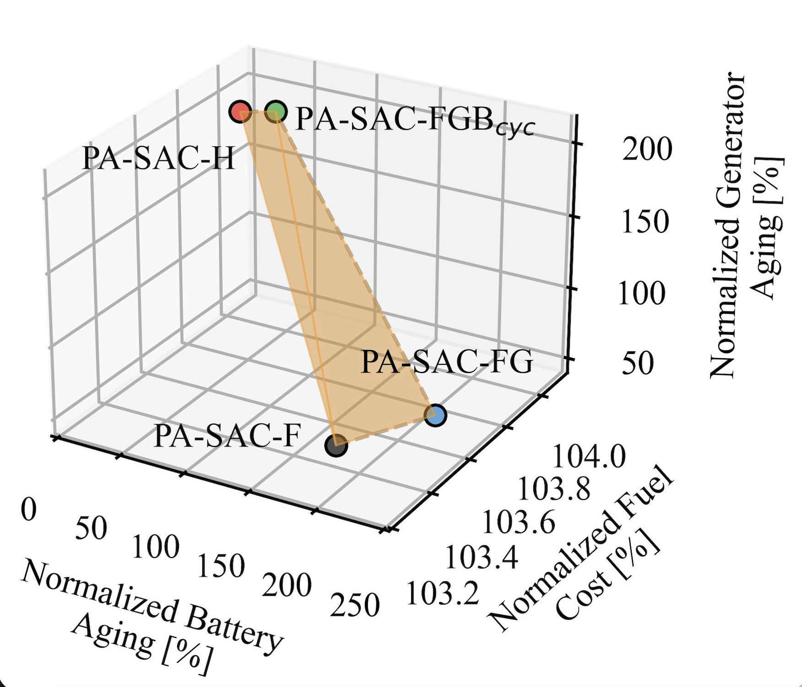
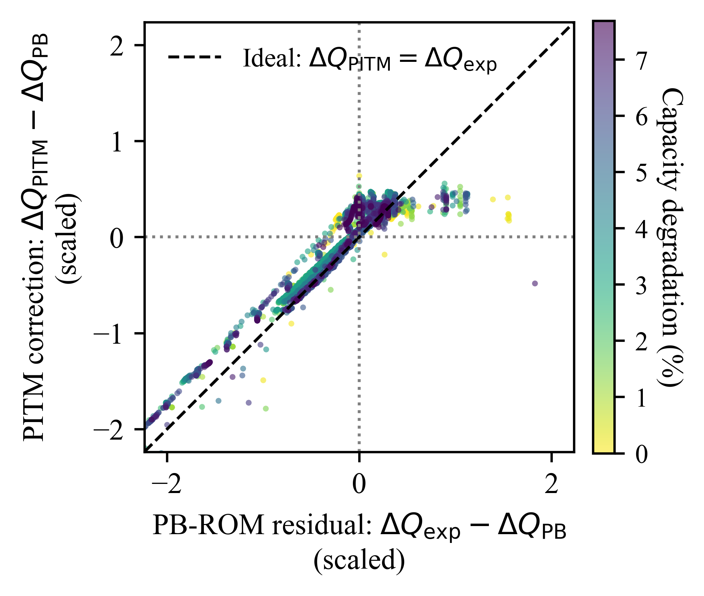
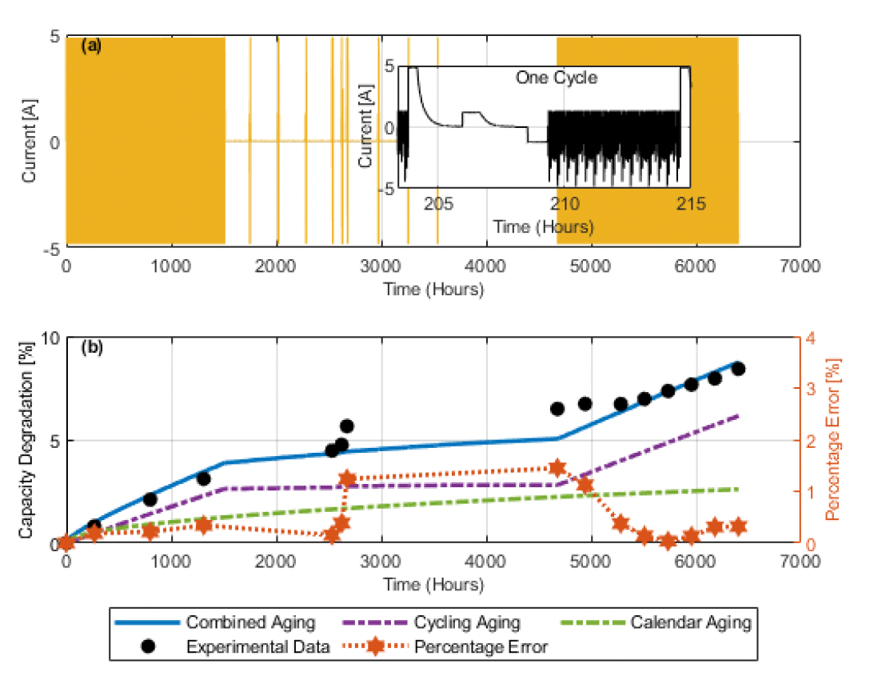
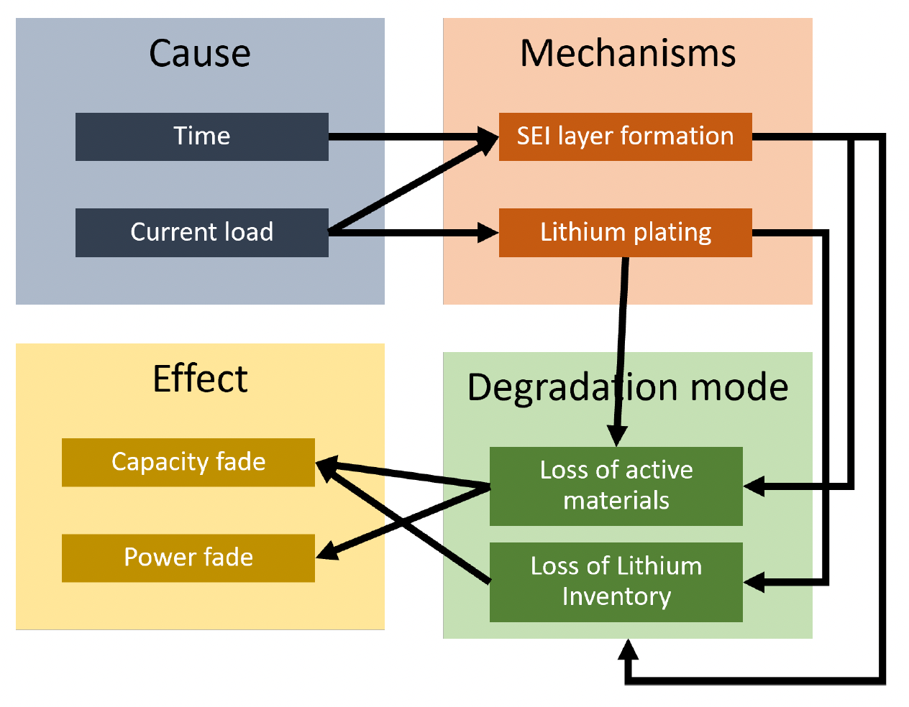

## About Me

I'm a PhD candidate in Mechanical Engineering at [Ohio State's Center for Automotive Research](https://car.osu.edu/), advised by [Dr. Qadeer Ahmed](https://car.osu.edu/people/ahmed.358). My research uses reinforcement learning and physics-informed deep learning to control hybrid-electric powertrains in a way that doesn't just minimize fuel consumption — it also slows the aging of the battery, electric machine, and aftertreatment system.

My PhD work is in collaboration with [Cummins Inc.](https://www.cummins.com/), where I'll be interning this summer as a Powertrain Electrification Controls Intern.

I'm graduating in **December 2026** and looking for full-time roles in **AI/ML engineering, controls, or applied research** starting early 2027.

---

## Research Interests

- **Deep reinforcement learning** for energy and aging management
- **Physics-informed deep learning** for system identification and prognostics
- **Multi-objective optimization** for electrified powertrains

---

## News

- **May 03, 2026** -- Paper *Physics-Aware Deep RL for Energy and Aging Management* accepted at *IEEE Transactions on Transportation Electrification*
- **Apr 2026** -- Joining [Cummins Inc.](https://www.cummins.com/) as a **Powertrain Electrification Controls Intern** for Summer 2026
- **Feb 06, 2026** -- Submitted *Physics-Aware Deep RL* journal paper for review
- **Jan 19, 2026** -- Paper *Learning Battery Aging Dynamics using Physics-Informed Transformer* accepted at *IEEE TTE*
- **Dec 17, 2025** -- Submitted *Physics-Informed Transformer* journal paper to *IEEE TTE*

Older News

- **Jun 19, 2025** -- Presented at [IEEE ITEC 2025](https://itec-conf.com/), Anaheim, CA
- **Apr 09, 2025** -- Presented at [SAE WCX 2025](https://wcx.sae.org/), Detroit, MI
- **Dec 2024** -- Submitted paper to IEEE ITEC 2025
- **Sep 2024** -- Submitted paper to SAE WCX 2025

---

## Selected Publications

::: {.grid}
::: {.g-col-12 .g-col-md-3}
{fig-alt="Pareto trade-off across PA-SAC variants"}
:::
::: {.g-col-12 .g-col-md-9}
**Physics-Aware Deep Reinforcement Learning for Energy and Aging Management in Electrified Powertrains** 
M.R. Rownak, W. Jaleel, A. Hanif, M.Q. Fahim, D.D. Le, H. Anwar, M. Nelson, & Q. Ahmed 
*IEEE Transactions on Transportation Electrification*, 2026 (accepted)
:::
:::

::: {.grid}
::: {.g-col-12 .g-col-md-3}
{fig-alt="PI-Transformer correction vs PB-ROM residual"}
:::
::: {.g-col-12 .g-col-md-9}
**Learning Battery Aging Dynamics Using Physics-Informed Transformer** 
M.R. Rownak, A. Hanif, M.Q. Fahim, D.D. Le, H. Anwar, W. Jaleel, M. Nelson, & Q. Ahmed 
*IEEE Transactions on Transportation Electrification*, vol. 12, no. 2, pp. 3792–3804, 2026.
[doi:10.1109/TTE.2026.3658446](https://doi.org/10.1109/TTE.2026.3658446)
:::
:::

::: {.grid}
::: {.g-col-12 .g-col-md-3}
{fig-alt="Aging model robustness: current profile and capacity degradation"}
:::
::: {.g-col-12 .g-col-md-9}
**Robustness and Sensitivity of Aging Models for Batteries and Electric Machines in Heavy-Duty Electrified Powertrains** 
M.R. Rownak, A. Hanif, Q. Ahmed, M.Q. Fahim, H. Anwar, H. Li, D.D. Le, & M. Nelson 
*IEEE ITEC 2025*, Anaheim, CA.
:::
:::

::: {.grid}
::: {.g-col-12 .g-col-md-3}
{fig-alt="Battery aging cause-mechanism-effect block diagram"}
:::
::: {.g-col-12 .g-col-md-9}
**Powertrain Components Aging Model Selection for Energy Efficient Vehicles: Selection Strategy and Challenges** 
M.R. Rownak, A. Hanif, Q. Ahmed, M.Q. Fahim, H. Anwar, H. Li, D. Le, & M. Nelson 
*SAE WCX 2025*, Detroit, MI.
:::
:::

[See all publications →](publications.qmd)

---

## Beyond Research

Outside of research, I enjoy traveling, long walks, and photography.

---

## Visitors

A small dot for every visitor.

